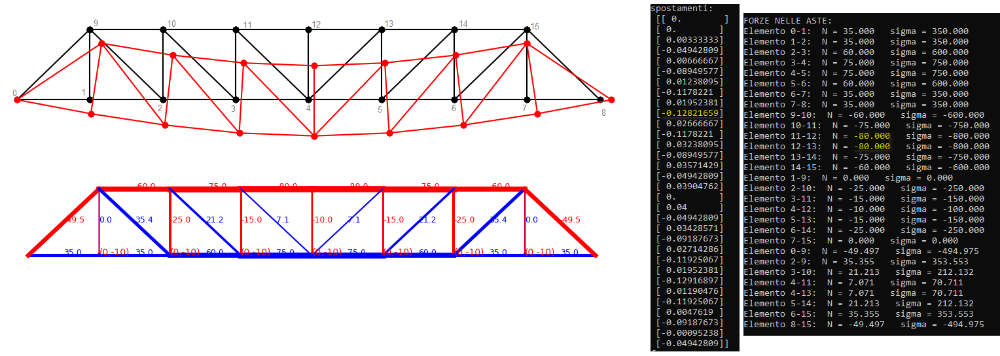

# miniFEM
minimal *Finite Element Method* calculator in **Python**

# ToDo

- [ ] **truss2D**
	- [ ] fare un confronto analitico su qualche caso semplice
	- [ ] migliorare il codice nelle parti commentate in maiuscoletto
	- [ ] riscrivere le parti fatte da ChatGPT
	- [ ] migliorare l'output grafico (in caso farlo con un altro script che prende il JSON)
	- [x] provare a fare il modello "continuo" con elementi fatti da 6 aste poste su 4 nodi (vedere l'equivalenza analitica e provare in un modello vs. tri2D)
		- [x] Modello Nrennikoff
		- [x] Confronto con `tri2D`
	- [ ] Piccolo documento _LaTeX_ in cui spiego la teoria ultra-base (lo potrei sponsorizzare anche come "FEM con meno di 80 righe...")
	- [ ] cercare instabilità numeriche nel codice

- [ ] **beam2D**
	- [ ] mettere anche il comando `equalDOF` in maniera tale da poter fare anche il caso "truss" qua dentro

- [ ] **tri2D**
	- [x] Esempio con il *Bulk modulus* $K$
	- [x] provare a fare una modale del bulk modulus e vedere se mi torna con il tank
 		- non mi torna e mi sembra troppo instabile il modello per essere utilizzabile in analisi MonteCarlo

- [ ] Altri casi presenti in _Zienkiewicz_

- [ ] Provare a implementare un codice molto semplice in MS-DOS usando `C` e la la libreria di matrici `SLAP`
	- [ ] truss2D
 	- [ ] beam2D
  	- [ ] tri2D

